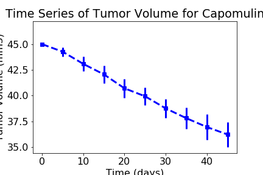
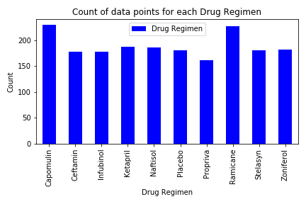
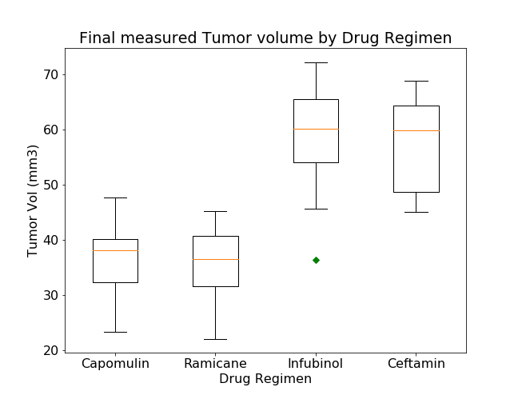
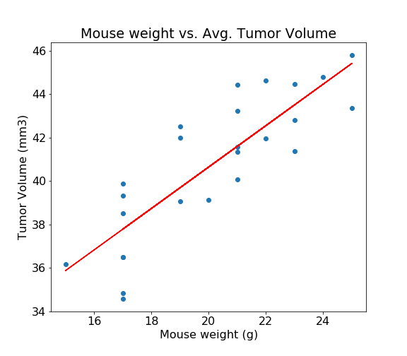

# Pymaceuticals Capomulin effects on Squamous Cell Carcinoma progression

Pymaceuticals specializes in anti-cancer pharmaceuticals. In its most recent efforts, it began screening for potential treatments for squamous cell carcinoma (SCC), a commonly occurring form of skin cancer.

In this study, 250 mice identified with SCC tumor growth were treated through a variety of drug regimens. Over the course of 45 days, tumor development was observed and measured. The purpose of this study was to compare the performance of Pymaceuticals' drug of interest, Capomulin, versus the other treatment regimens. The executive team also has asked for a top-level summary of the study results.

## Summary of study results

* The Drug regimen of Capomulin was effective in reducing the average SCC tumor volume in mice over a 45 day period. It would be interesting to continue the study past 45 days to see if the tumor would be completely ablated.  

* The number of data points for each Drug Regimen were all above 100 - usually statistical significance is obtained with a sample size of 30 or greater.

.

* The study had a near identical number of male and female mice. Determining if sex of the mouse was correlated to efficacy would be interesting to look at.

* Based on average final tumor volume both Capomulin and Ramicane appeared to be equally effective, but to be sure of this we would need to make sure the starting tumor volumes were equivalent. Of these four drugs of interest (Capomulin, Ramicane, Infubinol, and Ceftamin) only Infubinol had one outlier data point - the rest were "well behaved" with the datasets not having any outliers.

* Mouse weight correlated strongly (R-squared of 0.84) with average tumor volume. Therefore correlating only the final tumor volume to efficacy without controlling for mouse weight could skew the interpretation of efficacy.

